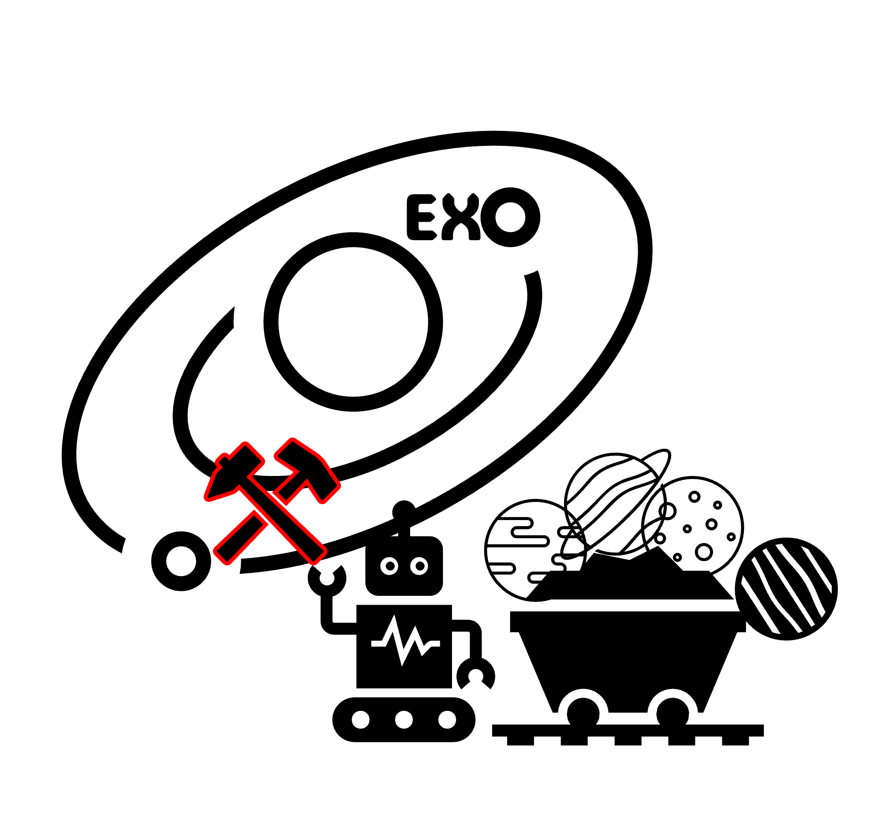
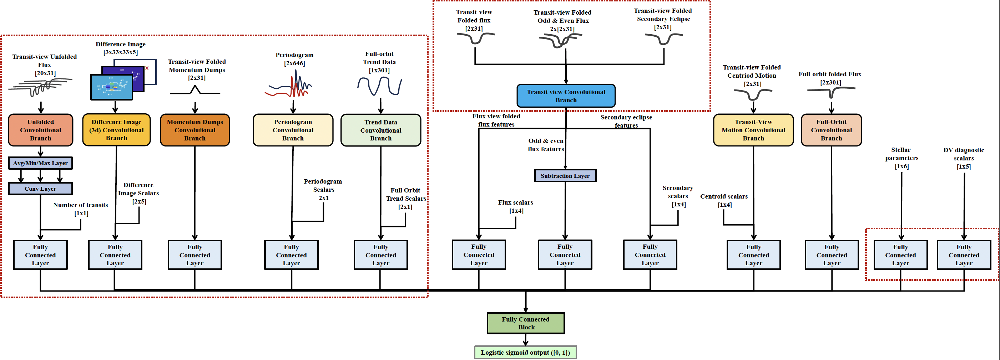
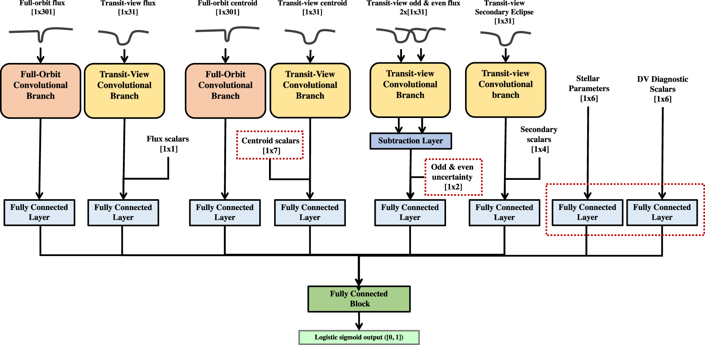
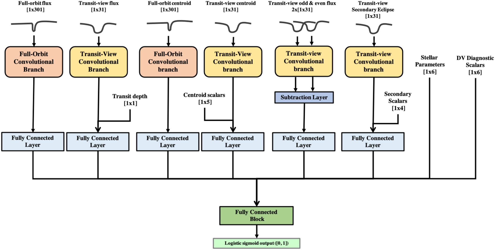

# ExoMiner

[Release Date: TBD].

[//]: # (![ExoMiner Logo.]&#40;/others/images/exominer_logo.png&#41;)

## Introduction

This project's mission is to develop, test, and deploy automated machine learning-based methods to sift ('mine') through 
transit photometry data from exoplanet survey missions such as Kepler and TESS and inform subject matter experts (SMEs) 
on potential transiting planet candidates.

ExoMiner is trained to classify a given TCE example as an **exoplanet** or a **non-planet** (i.e., false positive such 
as eclipsing binary, background objects, instrumental noise like momentum dumps) based on its prediction score between 
zero and one and a classification threshold value.

### Current main goals

The main goals of the `ExoMiner` pipeline are:

1. Perform classification of transit signals for TESS (2-min cadence and FFI).
2. Create vetting catalogs based on results produced for TESS SPOC Threshold Crossing Events (TCEs).
3. Validate new exoplanets from TESS.

## Model Architectures

- ExoMiner++ (TESS paper, January 2025)  **current**.

- ExoMiner (Kepler Multiplicity Boost paper, June 2023)

- ExoMiner (Kepler paper, February 2022)

## Data

All data used in this project are publicly available. Generally, the data used consist of:

- TCE and Objects of Interest (e.g. KOI and TOI catalogs) tables available in archives/respositories such as
  [NExSci](https://exoplanetarchive.ipac.caltech.edu/),
  [ExoFOP](https://exofop.ipac.caltech.edu/), [TEV](https://tev.mit.edu/data/) and
  [MAST](https://archive.stsci.edu/);
- Light curve and target pixel FITS files and other data products generated by the TESS Science Processing Operations 
- Center (SPOC) pipeline available in archives such as the [MAST](https://archive.stsci.edu/).

## References

For more detailed information see the following publications:
- ExoMiner 2021
  paper ["ExoMiner: A Highly Accurate and Explainable Deep Learning Classifier that Validates 301 New Exoplanets"](https://arxiv.org/abs/2111.10009)
  , published 2022 February 17 in
  the [Astrophysical Journal, Volume 926, Number 2](https://iopscience.iop/articl/10.3847/1538-4357/ac4399/).
- ExoMiner w/ Multiplicity Boost, published 2023 June 26 in the [Astronomical Journal, Volume 166, Number 1](https://iopscience.iop.org/article/10.3847/1538-3881/acd344/)

## Contacts
- Hamed Valizadegan (PI, USRA contractor),  hamed.valizadegan@nasa.gov
- Miguel Martinho (Co-I, USRA contractor), miguel.martinho@nasa.gov
- Nikunj Oza (Group Lead, NASA ARC civil servant), nikunj.c.oza@nasa.gov

## Credits

This work was developed by members of the Data Sciences Group, DASH, Intelligent Systems Division (Code-TI) at NASA Ames 
Research Center (NASA ARC).

- Main Contributors
  - Hamed Valizadegan1,2, hamed.valizadegan@nasa.gov
  - Miguel Martinho1,2, miguel.martinho@nasa.gov
  
- Collaborators
    - Jon Jenkins1
    - Doug Caldwell1,3
    - Joseph Twicken1,3

1 - NASA Ames Research Center (NASA ARC)\
2 - Universities Space Research Association (USRA)\
3 - The SETI Institute

## Acknowledgements

We would like to acknowledge people that in some way supported our efforts:

- We would like to thank to Steve Bryson and Jeff Smith for their domain expertise.
- David Armstrong for an insightful discussion that improved our work.
- Megan Ansdell for providing information on their code and work.
- Resources supporting this work were provided by the NASA High-End Computing (HEC) Program through the NASA Advanced 
Supercomputing (NAS) Division at Ames Research Center.
- We would like to thank all interns that collaborated directly or indirectly to this work: Ashley Raigosa, Andrés 
Carranza, Fellipe Marcellino, Jennifer Andersson, Kaylie Hausknecht, Laurent Wilkens, Martin Koeling,
 Nikash Walia, Noa Lubin, Pedro Gerum, Patrick Maynard, Sam Donald, Theng Yang, Hongbo Wei,
 Stuti Agarwal, Joshua Belofsky, Charles Yates, William Zhong, Saiswaroop Thammineni, Kunal Malhotra,
 Eric Liang, Ujjawal Prasad, Adithya Giri, Josue Ochoa.

- Miguel Martinho and Hamed Valizadefan are supported through TESS XRP 2022 contract 22-XRP22_2-0173, NASA Academic 
Services Mission (NAMS) contract number NNA16BD14C as well as the Intelligent Systems Research and Development-3
(ISRDS-3) Contract 80ARC020D00100. Douglas Caldwell and Joseph Twicken are supported through NASA Cooperative 
Agreement 80NSSC21M0079. 

- We would like to thank multiple people who directly or indirectly contributed to this work. This work includes data 
collected by the TESS mission and obtained from the MAST data archive at the Space Telescope Science Institute 
(STScI). Funding for the TESS mission was provided by the NASA Science Mission Directorate. Resources supporting 
this work were provided by the NASA High-End Computing (HEC) Program through the NASA Advanced Supercomputing (NAS) 
Division at Ames Research Center for the production of the TESS SOC data products and for training our deep learning 
model, ExoMiner. 
Funding for the TESS mission is provided by NASA's Science Mission Directorate. We acknowledge support from the TESS 
mission via subaward s3449 from MIT. This work makes use of observations from the LCOGT network. Part of the LCOGT 
telescope time was granted by NOIRLab through the Mid-Scale Innovations Program (MSIP). MSIP is funded by NSF. This 
work is based on observations made with the Las Cumbres Observatory’s education network telescopes that were upgraded 
through generous support from the Gordon and Betty Moore Foundation. This work is based on observations made with the 
MuSCAT3/4 instruments, developed by the Astrobiology Center (ABC) in Japan, the University of Tokyo, and Las Cumbres 
Observatory (LCOGT). MuSCAT3 was developed with financial support by JSPS KAKENHI (JP18H05439) and JST PRESTO 
(JPMJPR1775), and is located at the Faulkes Telescope North on Maui, HI (USA), operated by LCOGT. MuSCAT4 was developed 
with financial support provided by the Heising-Simons Foundation (grant 2022-3611), JST grant number JPMJCR1761, and 
the ABC in Japan, and is located at the Faulkes Telescope South at Siding Spring Observatory (Australia), operated by 
LCOGT. This research has made use of the Exoplanet Follow-up Observation Program (ExoFOP; DOI: 10.26134/ExoFOP5) 
website, which is operated by the California Institute of Technology, under contract with the National Aeronautics and 
Space Administration under the Exoplanet Exploration Program.

This material is based upon work supported by the NASA under Agreement No. 80NSSC21K0593 for the program 
"Alien Earths''. The results reported herein benefitted from collaborations and/or information exchange within 
NASA’s Nexus for Exoplanet System Science (NExSS) research coordination network sponsored by NASA’s Science Mission 
Directorate.

This work makes use of observations from the ASTEP telescope. ASTEP benefited from the support of the French and I
talian polar agencies IPEV and PNRA in the framework of the Concordia station program and from OCA, INSU, Idex UCAJEDI 
(ANR- 15-IDEX-01) and ESA through the Science Faculty of the European Space Research and Technology Centre (ESTEC). 
This research also received funding from the European Research Council (ERC) under the European Union's Horizon 2020 
research and innovation program (grant agreement No. 803193/BEBOP) and from the Science and Technology Facilities 
Council (STFC; grant No. ST/S00193X/1).

See the [NASA Open Source Agreement (NOSA)](licenses/nasa_open_source_agreement_ExoMiner-18792-1.pdf) for this software release.

For external collaborators, see the 
[Individual](ExoMiner_ARC-18792-1_Individual%20CLA.pdf) and [Corporate](licenses/Corporate_CLA_ExoMiner_ARC-18792-1.pdf) 
Contributor License Agreements.

* * * * * * * * * * * * * * 
Notices:

Copyright © 2024 United States Government as represented by the Administrator of the National Aeronautics and Space Administration.  All Rights Reserved.

Disclaimers

No Warranty: THE SUBJECT SOFTWARE IS PROVIDED "AS IS" WITHOUT ANY WARRANTY OF ANY KIND, EITHER EXPRESSED, IMPLIED, OR STATUTORY, INCLUDING, BUT NOT LIMITED TO, ANY WARRANTY THAT THE SUBJECT SOFTWARE WILL CONFORM TO SPECIFICATIONS, ANY IMPLIED WARRANTIES OF MERCHANTABILITY, FITNESS FOR A PARTICULAR PURPOSE, OR FREEDOM FROM INFRINGEMENT, ANY WARRANTY THAT THE SUBJECT SOFTWARE WILL BE ERROR FREE, OR ANY WARRANTY THAT DOCUMENTATION, IF PROVIDED, WILL CONFORM TO THE SUBJECT SOFTWARE. THIS AGREEMENT DOES NOT, IN ANY MANNER, CONSTITUTE AN ENDORSEMENT BY GOVERNMENT AGENCY OR ANY PRIOR RECIPIENT OF ANY RESULTS, RESULTING DESIGNS, HARDWARE, SOFTWARE PRODUCTS OR ANY OTHER APPLICATIONS RESULTING FROM USE OF THE SUBJECT SOFTWARE.  FURTHER, GOVERNMENT AGENCY DISCLAIMS ALL WARRANTIES AND LIABILITIES REGARDING THIRD-PARTY SOFTWARE, IF PRESENT IN THE ORIGINAL SOFTWARE, AND DISTRIBUTES IT "AS IS."

Waiver and Indemnity:  RECIPIENT AGREES TO WAIVE ANY AND ALL CLAIMS AGAINST THE UNITED STATES GOVERNMENT, ITS CONTRACTORS AND SUBCONTRACTORS, AS WELL AS ANY PRIOR RECIPIENT.  IF RECIPIENT'S USE OF THE SUBJECT SOFTWARE RESULTS IN ANY LIABILITIES, DEMANDS, DAMAGES, EXPENSES OR LOSSES ARISING FROM SUCH USE, INCLUDING ANY DAMAGES FROM PRODUCTS BASED ON, OR RESULTING FROM, RECIPIENT'S USE OF THE SUBJECT SOFTWARE, RECIPIENT SHALL INDEMNIFY AND HOLD HARMLESS THE UNITED STATES GOVERNMENT, ITS CONTRACTORS AND SUBCONTRACTORS, AS WELL AS ANY PRIOR RECIPIENT, TO THE EXTENT PERMITTED BY LAW.  RECIPIENT'S SOLE REMEDY FOR ANY SUCH MATTER SHALL BE THE IMMEDIATE, UNILATERAL TERMINATION OF THIS AGREEMENT. 

* * * * * * * * * * * * * * 